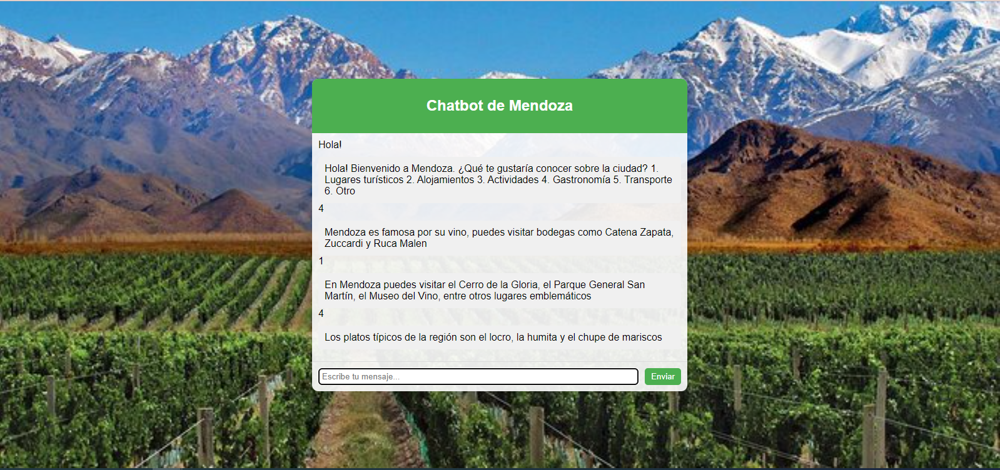

# Chatbot IA

Este chatbot utiliza inteligencia artificial para interactuar con los usuarios. Funciona mediante la clasificación de mensajes en categorías predefinidas, las cuales están especificadas en el archivo `intents.json`. Estas categorías representan los distintos tipos de mensajes que el chatbot puede reconocer y responder.

## Estructura del Proyecto

El proyecto está organizado en tres archivos principales:

1. **intents.json**: En este archivo se definen las categorías de mensajes (intenciones) junto con los patrones de mensajes asociados y las posibles respuestas para cada intención.
2. **training.py**: Aquí se lleva a cabo el entrenamiento del modelo de clasificación utilizando los datos del archivo `intents.json`. Se procesan los datos y se genera un modelo capaz de predecir la intención de un mensaje nuevo.
3. **chatbot.py**: Una vez que el modelo ha sido entrenado, este archivo se utiliza para interactuar con los usuarios. El chatbot recibe un mensaje del usuario, lo clasifica utilizando el modelo entrenado y proporciona una respuesta adecuada basada en la intención detectada.
4. **app.py**: El servidor Flask que maneja la interacción entre el usuario y el chatbot mediante una interfaz web.

## Instrucciones para Probar

Para probar el chatbot, sigue estos pasos:

### 1. Crear un entorno virtual

Es recomendable crear un entorno virtual para manejar las dependencias del proyecto sin conflictos. Ejecuta los siguientes comandos en tu terminal:

```bash
python -m venv venv
```

Activa el entorno virtual:
- En Windows:
  ```bash
  venv\Scripts\activate
  ```
- En macOS y Linux:
  ```bash
  source venv/bin/activate
  ```

### 2. Instalar las dependencias

Instala las dependencias necesarias utilizando el archivo `requirements.txt`:

```bash
pip install -r requirements.txt
```

### 3. Modificar el archivo `intents.json`

Modifica los patrones y las respuestas en el archivo `intents.json` según las necesidades del proyecto.

### 4. Entrenar el modelo

Ejecuta el archivo `training.py` para entrenar el modelo. Puedes ajustar los parámetros del modelo y del optimizador según sea necesario:

```bash
python training.py
```

### 5. Ejecutar el chatbot

Una vez completado el entrenamiento, ejecuta el archivo `app.py` para levantar el servidor de Flask e interactuar con el chatbot:

```bash
python app.py
```

Accede a la interfaz web del chatbot mediante tu navegador en la dirección `http://127.0.0.1:5000`.

¡Disfruta utilizando el chatbot y explorando las capacidades de la inteligencia artificial!


## Vista del Chatbot

